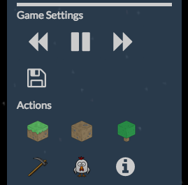
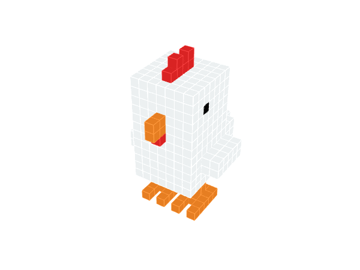

# EVOX

##What is it?
EVOX is a 3D life simulator game where you can create your own landscapes and populate them with creatures. Each creature has its own set of abilities on top of basic behaviors such as procreation and death, and you can observe over time how the combination of these skillsets affect the balance of the ecosystem. EVOX is inspired by Conway's Game of Life, and the fundamental concept is to visualize the theory of evolution. To learn more:

Play the game: www.evox.life  
Watch an overview: https://www.youtube.com/watch?v=sVJ3vTde7nQ

##How to play
After creating an account, head to the Creatures page and choose between building your own creature from scratch, or modifying one of the available default creatures. Once you've created one that you want to proceed with, navigate to the Worlds page and create your own environment. After providing a name, you'll be presented with three types of environments, each one with its own versions of predator and prey:

|Environment      | Predator            | Prey            |
|--------| :------------- |:-------------|
| Grassland  | Fox     | Turtle |
| Desert | Crocodile, Lion      | Giraffe, Elephant     |
| Ice | Wolf| Penguin, Deer, Beaver    |

Define the size of the landscape, the terrain type (flat/multilevel), then save. To play the world, select it and click play.

####Gameplay
You can interact with the world using the control panel on the top right. Slow down, pause, or speed up time, and save the game at any point. 

Use setting buttons to control gameplay!

##land and food icons modify your environment!

##Spawn Grass

##Remove Grass

##Remove a block.

##Feeder critters!

##Get game info

##Click on a creature to get their stats. Remember to feed them if they are hungry!
#Icons above a creature indicate their current behavior.

#Searching for food.

#A creature is eating.

#Searching for other animals to herd with.

#The animal has died! :(

#If animals are healthy and the timing is right, animals will procreate!

###Contributors
- [Richard Michels](https://github.com/richardalexandermichels)
- [Justin Kim](https://github.com/jkim430)
- [Pete Steele](https://github.com/celanajaya)
- [Yves Yuen](https://github.com/justYves)

##Time
At 1X speed, a second IRL equals to 4 minutes IG.
1 day ig = 1 month ig

|IG      | 1x            | 2X            | 4X    |
|--------| :------------- |:-------------:| -----:|
| 1 day  | 6 m     | 3m | 90s |
| 1 month| 6 m      | 3m     |   90s|
| 1 year| 1h12m| 36m    |    18m |

Welcome to Your World!

